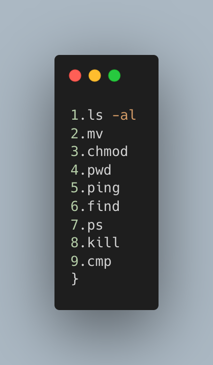

# lab00

## task

- [x] Which command walks a file hierarchy in search of a keyword?
- [ ] Which command displays information about processes running on your machine?
- [ ] Which command terminates a process?
- [ ] Which command can help you find the difference between two files?

## Answers

1. `find`

   **<u>find</u>**

     Find files or directories under the given directory tree, recursively.
     More information: https://manned.org/find.

     - Find files by extension:
       `find root_path -name '*.ext'`

     - Find files matching multiple path/name patterns:
       `find root_path -path '**/path/**/*.ext' -or -name '*pattern*'`

     - Find directories matching a given name, in case-insensitive mode:
       `find root_path -type d -iname '*lib*'`

     - Find files matching a given pattern, excluding specific paths:
       `find root_path -name '*.py' -not -path '*/site-packages/*'`

     - Find files matching a given size range:
       `find root_path -size +500k -size -10M`

     - Run a command for each file (use {} within the command to access the filename):
       `find root_path -name '*.ext' -exec wc -l {} \;`

     - Find files modified in the last 7 days and delete them:
       `find root_path -daystart -mtime -7 -delete`

     - Find empty (0 byte) files and delete them:
       `find root_path -type f -empty -delete`

2. `ps`

   A process is nothing but tasks within the Linux operating system. (In simple way it could be understood as a running process, apparently every running process is running at least a task ). For instance, a process named http used to display web pages, another porcess called `mysqld` provides database service. By using `ps` command, we could obtain the information about the process, like PIDs(process identification numbers). `ps` give a snapshot of the currently running processes. If we want a repetitive update of this status, `top`,`atop`,`htop` are good assistant!

   **<u>ps</u>**

     Information about running processes.
     More information: https://manned.org/ps.

     - List all running processes:
       `ps aux`
       - `a` select all process
       - `u` select all processes on terminal, including those of other users
       - `x` select processes without controlling ttys
     - List all running processes including the full command string:
       `ps auxww`
     - Search for a process that matches a string:
       `ps aux | grep string`
     - List all processes of the current user in extra full format:
       `ps --user $(id -u) -F`
     - List all processes of the current user as a tree:
       `ps --user $(id -u) f`
     - Get the parent PID of a process:
       `ps -o ppid= -p pid`
     - Sort processes by memory consumption:
       `ps --sort size`

3. `kill`

   - SIGHUP (1) – Hangup detected on controlling terminal or death of controlling process. Use SIGHUP to **reload configuration files and open/close log** files.

   - SIGKILL (9) – Kill signal. Use SIGKILL as a **last resort** to kill process. It will not save data or cleaning kill the process.

   - SIGTERM (15) – Termination signal. It is **the default and safest way** to kill process.

   3.1 `pidof`

     Gets the ID of a process using its name.
     More information: https://manned.org/pidof.

     - List all process IDs with given name:
       `pidof bash`

     - List a single process ID with given name:
       `pidof -s bash`

     - List process IDs including scripts with given name:
       `pidof -x script.py`

     - Kill all processes with given name:
       `kill $(pidof name)`

   `

4. `diif` & `cmp`

   - `diff` compare two files line by line.

   Most commonly used command pattern in `diff` is `diff -q txt1.txt txt2.txt`, for in most cases we only want to know whether two `*.txt` file is different or not. And after we print the above command, we will get the return like this: `Files test1.txt and test2.txt differ`. 

   And we also should know there exists a tool called `patch`, which could help 

   - `cmp` compare two files character by character.

   `cmp` and `diff -q` results are similar, noting that `cmp` will return your on which line the differences emerge.

