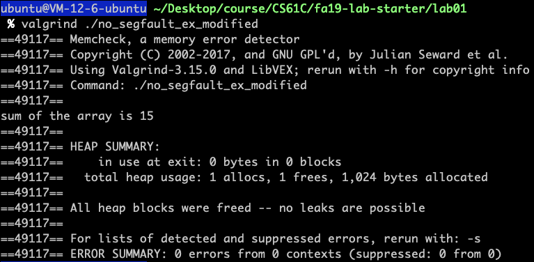

# lab01

- [x] gdb.txt
- [x] `cgdb` debugging exercise
- [x] `Valgrind`ing away
- [x] Pointers and Structures in C


## Action Item

1. While you’re in a gdb session, how do you **set the arguments** that will be passed to the program when it’s run?

   `set args [Arguments]`

   `show args`

   

2. How do you **create a breakpoint**

   - For `cgdb`
     - Change working section
       - press <esc> to enter the source code, and by pressing '`space`' to set a breakpoint at the current line.
       - press `i` on the keyboard to back to the `(gdb)` terminal
     - Set breakpoints
       1. in source section, press `space`on key board to set current line as a breakpoint.
       2. in gdb terminal, use command like this `b [n]` to set breakpoint at the  `n`th line. `b [file:] line`
       3. `b [file:] function` like `b main`, you set a breakpoint at the 'main' function entry.

3. How do you **execute the next line of C code** in the program after stopping at a breakpoint?

   By pressing `n` on our keyboard, execute next line including any funciton calls.

   One thing we should notice is the difference between the `n` and `c`

   - By pressing `c` on our keyboard.`continue [count]`or `c [count]`continue running; if *count* specifies, ignore this breakpoint next [count] times

4. If the next line of code is a function call, you’ll execute the whole function call at once if you use your answer to #3. (If not, consider a different command for #3!) How do you tell GDB that you **want to debug the code inside the function** (i.e. step into the function) instead? (If you changed your answer to #3, then that answer is most likely now applicable here.)

   `step`

   the difference between `stepi` and `step` mainly in that `stepi`= step by *machine instructions* rather than source line.

5. How do you **continue the program after stopping** at a breakpoint?

   `c`:ignore this breakpoint 

6. How can you **print the value of a variable** (or even an expression like 1+2) in gdb?

   `p [local_variable_name]`

7. How do you configure gdb so it **displays the value of a variable after every step**?

   

8. How do you **show a list of all variables and their values** in the current function?

   `info locals`: to list "local variables of current stack frame"(names and values), including variables in that funciton

   to list "All global and static variable names"(It might be a hug list)

   `info variables`:: to list "All global and static variable names"(It might be a hug list)

   - ```c
     void foo(a){
         int a;
     		if(a < 10){
           bar(a);
         }else{
           /* stop here */
           process(a); 
         }
     }
     
     int bar(int a){
       foo(a + 5);
     }
     ```

     ```bash
     (gdb) p a
     $1 = 10
     (gdb) p bar::a
     $2 = 5
     (gdb) up 2
     #2  0x080483d0 in foo (a=5) at foobar.c:12
     (gdb) p a
     $3 = 5
     (gdb) p bar::a
     $4 = 0
     ```

     The above shows how we could obtain the local variable separtely.

   `info args`: to list "Argumnets of the current stack frame"(name and values)

   `info register`:show all the current value in the registers.

9. How do you **quit** out of gdb?

   `(gdb) quit`

   

## Debugging w/ YOU(ser input)

If our program need input from `stdIn`(this will be clearly explained in os related class, like cs162, 6.s081, csapp, etc.), then how do we debug this kind of program!


**Redirction!**


Let's if our program!

```c
#include <stdio.h>

#define MAX_LEN 80

int main(int argc, char *argv[]) {
    char a_word[MAX_LEN];

    printf("What's your name?\n");
    fgets(a_word, MAX_LEN, stdin);
    printf("Hey, %sI just really wanted to say hello to you.\nI hope you have a wonderful day.", a_word);

    return 0;
}
```

In normal way, we can't well test whether it's right or not, so by creating a `*.txt` like `name.txt` and redirect it when running we could  elegently solve the problem above.

Let's see!


Well, at this moment, I begin to feel `debugging` is awesome intersting!

Truly!


## Valgrind’ing away

Even with a debugger, we might not be able to catch all bugs. Some bugs are what we refer to as “bohrbugs”, meaning they manifest reliably under a well-defined, but possibly unknown, set of conditions. Other bugs are what we call “heisenbugs”, and instead of being determinant, they’re known to disappear or alter their behavior when one attempts to study them. **We can detect the first kind with debuggers, but the second kind may slip under our radar because they’re (at least in C) often due to mis-managed memory.**

Valgrind is a program which emulates your CPU and tracks your memory accesses. 


Obviously, the `sizeof(a)` in `no_segfault_ex.c` remain problem as well, but why this make no segmentation fault! And what is segmentation fault!

- `valgrind ./segfault_ex`

  

- `valgrind ./no_segfault_ex`

  

- `valgrind ./no_segfault_ex_modified`

  


## Pointers and Structures in C

`ll_cycle.c`

To determine whether a single linked list has a loop.

This is a classic algorithm problem, the haedest version is to return the start node of the loop, but for us we only need to figure out whether our linklist has a loop(`return 1`) or hasn't(`reutrn 0`). See [Wikipedia article](https://en.wikipedia.org/wiki/Cycle_detection#Floyd.27s_Tortoise_and_Hare) for advice! 

`ll_cycle.h`

```c
#ifndef LL_CYCLE_H
#define LL_CYCLE_H
typedef struct node {
    int value;
    struct node *next;
} node;

int ll_has_cycle(node *);
#endif%
```


`ll_cycle.c`

```c
#include <stddef.h>
#include "ll_cycle.h"

int ll_has_cycle(node *head) {
    /* your code here */
    return 0;
}
```

#### Answer

```c
#include <stddef.h>
#include "ll_cycle.h"

int ll_has_cycle(node *head) {
    /* your code here */
    node *fast = head;// hare
    node *slow = head;// tortoise
    while(fast && fast->next){
        slow = slow->next;
        fast = fast->next->next;
        if(slow == fast){
            return 1;
        }
    }
    return 0;
}
```

One more thing

If we want solve harder version of this, then how?


$d_{slow}: x + y$

$d_{fast}: x + y + n*(y+z)$
$$
To \ find \ the\ entry \ of \ the \ loop:
\\
d_{slow} = d_{fast}
\\
x = (n-1)(y+z) + z
$$
And we know that (y+z) is a complete circle, so we could find the solution as follow: One pointer from the head node and one pointer from the meeting node, both pointers go one node at a time, then when these two pointers meet is the entrance node of the circular link list.

```c
int ll_detect_cycle(node *head) {
    /* your code here */
    node *fast = head;// hare
    node *slow = head;// tortoise
    while(fast && fast->next){
        slow = slow->next;
        fast = fast->next->next;
        if(slow == fast){ // find the meeting point
            node *index1 = fast; // go 'z' distance
          	node *index2 = head; // go 'x' distance
          	while(index1 != index2){
                 index1 = index1->next;
                 index2 = index2->next;
            }
          	return index1;
        }
    }
    return NULL;
}
```

